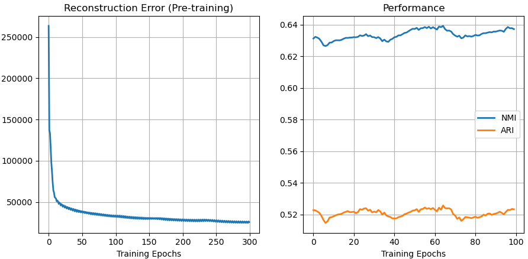

### DCN: Deep Clustering Network
I found the official implementation of deep clustering network (DCN) is outdated (https://github.com/boyangumn/DCN-New). This repo is a re-implementation of DCN using PyTorch.

#### Introduction
An interesting work that jointly performs unsupervised dimension reduction and clustering using a neural network autoencoder.

#### How to run
Here I offer a demo on training DCN on the MNIST dataset (corresponding to Section 5.2.5 in the raw paper). To run this demo, simply type the following command:

```
python mnist.py
```

#### Experiment
I trained the DCN model on MNIST dataset, hyper-parameters like network structure were set as values reported in the paper. The left figure presents the reconstruction error of the autoencoder during the pre-training stage, and the right figure presents changes on NMI and ARI (two metrics employed in the paper) during the training stage. The best NMI result I have got is around 0.65.



#### Package dependency
* scikit-lean==0.23.1
* pytorch==1.6.0
* torchvision==0.7.0
* joblib==0.16.0

In my practice, this implementation also works fine on PyTorch 0.4.1. Feel free to open an issue if there were incompatibility problems.

#### Reference
* Yang et al. ''Towards K-means-friendly Spaces: Simultaneous Deep Learning and Clustering'', ICML-2017 (https://arxiv.org/pdf/1610.04794.pdf)
